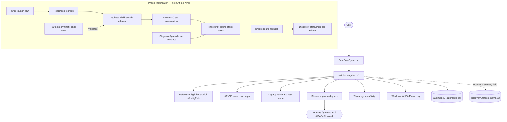

# Architecture

[`script-corecycler.ps1`](../../script-corecycler.ps1) is a script-centered Windows application. It owns configuration loading, topology discovery, stress-program lifecycle, process affinity, error detection, legacy Automatic Test Mode, persistence, WHEA observation, Event Log integration, and shutdown. It drives bundled executables rather than exposing a service or library API.

The discovery work adds isolated contracts around that existing runtime. Phase 1 and Phase 2 state helpers are now connected to optional discovery snapshot persistence, while the Phase 3 stage/evidence/suite/child helpers remain deliberately outside the production runtime path until the coordinator and parser boundary is authorized and implemented.

## System diagram

## Existing runtime and legacy ATM

1. The main script resolves the default config or an explicit `-ConfigPath`, then imports and validates settings.
2. It determines processor, physical-core, logical-CPU, APIC, SMT, and processor-group relationships.
3. A stress adapter runs while CoreCycler assigns threads to a physical core.
4. Existing log/process/WHEA paths drive legacy ATM outcomes; ATM adjusts a failing value toward `maxValue` or confirms after configured consecutive passes.
5. State is saved to `.automode`, retaining `.automode-bak`; optional discovery state is serialized only when discovery state exists, preserving the legacy document shape otherwise.

Legacy ATM remains uphill-only. Its `confirmed`, `knownGoodValues`, `maxValue`, error/reset, and crash/resume semantics are not reused as a direction-neutral discovery policy.

## Implemented discovery boundaries

- [`helpers/discovery-state.psm1`](../../helpers/discovery-state.psm1) provides pure candidate transitions, evidence classification, schema v2 snapshot conversion/restoration, interruption handling, terminal filtering, and fresh retry identity checks.
- [`helpers/discovery-stage.psm1`](../../helpers/discovery-stage.psm1) fingerprints exact config bytes, creates identity-bound stage contexts, and rejects stale or mismatched terminal results.
- [`helpers/discovery-suite.psm1`](../../helpers/discovery-suite.psm1) enforces workload order, verified application, exact lifecycle booleans, and final-stage-only `OBSERVED_PASS` conversion.
- [`helpers/discovery-child-launch.psm1`](../../helpers/discovery-child-launch.psm1) creates a fixed tokenized PowerShell invocation, rechecks readiness, binds externally observed PID/start time, and exposes an isolated launch adapter. Its only current execution coverage is a harmless temporary test child.

## Current non-integration boundary

The Phase 3 helpers are not imported by the discovery scheduler because that scheduler does not yet exist. No real CoreCycler child, workload parser, CO application, UAC/elevation, scheduler/resume action, or hardware operation is part of the current implementation. The next integration boundary must preserve candidate/stage/config/log/PID/start-time identity and verify child exit plus expected stress-process cleanup before suite advancement.

Sources: [`GOAL.md`](../../GOAL.md), [`DESIGN.md`](../../DESIGN.md), [`DECISIONS.md`](../../DECISIONS.md), [`PLAN.md`](../../PLAN.md), [`ISSUES.md`](../../ISSUES.md).
