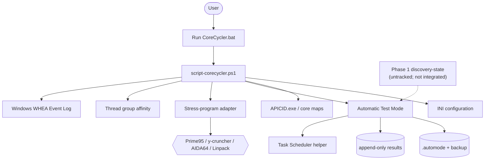

# Architecture

[`script-corecycler.ps1`](../../script-corecycler.ps1) is a script-centered Windows application. It owns configuration loading, topology discovery, stress-program lifecycle, process affinity, error detection, Automatic Test Mode, persistence, and shutdown. It drives bundled executables rather than exposing a service or library API.

Existing ATM moves toward *less aggressive* values after errors and marks values `confirmed` after repeated passes. The proposed opt-in discovery policy is different: it moves one unit more negative only after a verified complete suite and records discovery-specific evidence and resolution state. It must not overload ATM's `confirmed` or `knownGoodValues` semantics.

## System diagram

## Existing ATM flow

1. The main script imports and validates settings.
2. `Initialize-AutomaticTestMode` checks elevation/platform prerequisites, prepares values and state, and optionally creates a resume task.
3. A stress adapter runs while CoreCycler assigns threads to a physical core.
4. Existing log/process/WHEA paths determine ATM outcomes; ATM can adjust a failing value toward `maxValue` or confirm after configured consecutive passes.
5. State is saved to `.automode`, retaining `.automode-bak`; permanent results are appended separately.

## Planned discovery flow

1. Schedule unresolved cores at the current synchronous descending rung.
2. Persist candidate identity, apply it, and verify the effective CO map.
3. Run every required workload stage with fresh stage identity and evidence boundary.
4. Accept `OBSERVED_PASS` only for a verified complete suite, then advance exactly `-1`.
5. Resolve attributed failure to the prior pass, quarantine ambiguous disruption, and retry controlled infrastructure invalidation without moving the boundary.

This is a design target, not current production behavior.

## Load-bearing boundaries

- Current resume assumes the last tested core may have crashed and increases its value before reapplication. Discovery needs separate retry/quarantine policy.
- WHEA APIC mapping is required for trustworthy physical-core attribution.
- CO writes and stress workloads are consequential hardware operations; Phase 1 must remain pure.

Sources: [`GOAL.md`](../../GOAL.md), [`DESIGN.md`](../../DESIGN.md), [`DECISIONS.md`](../../DECISIONS.md), [`PLAN.md`](../../PLAN.md), [`ISSUES.md`](../../ISSUES.md).
