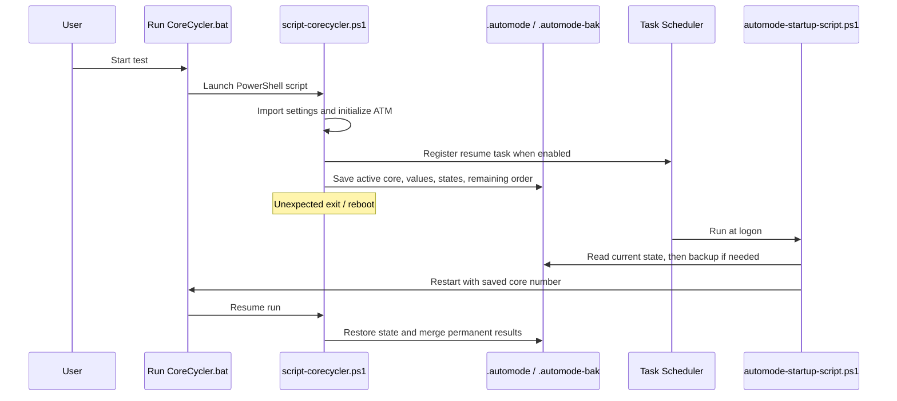

# Sequence Diagrams

## Existing Automatic Test Mode startup and recovery



This reflects the current ATM implementation.

## Proposed discovery candidate evidence flow

```mermaid
sequenceDiagram
    participant Scheduler as Discovery scheduler
    participant State as Durable discovery state
    participant CO as Existing CO application
    participant Verify as Effective-map verification
    participant Stage as Workload stage
    participant Evidence as Evidence classifier

    Scheduler->>State: Persist candidate attempt identity
    Scheduler->>CO: Apply active-core candidate
    CO-->>Verify: Applied map
    Verify->>State: Persist APPLIED_VERIFIED
    loop Each required stage
        Scheduler->>Stage: Start with fresh stage-attempt ID
        Stage-->>Evidence: Workload/log/WHEA evidence
        Evidence->>State: Persist stage result
    end
    alt Verified complete suite passes
        Evidence->>State: Record pass; advance exactly -1
    else Positive attributable failure
        Evidence->>State: Resolve to previous pass
    else Ambiguous disruption
        Evidence->>State: Quarantine; no boundary
    else Infrastructure invalidation
        Evidence->>State: Preserve boundary; retry when trustworthy
    end
```

This second diagram documents the `DESIGN.md` target, not a current production call path.
