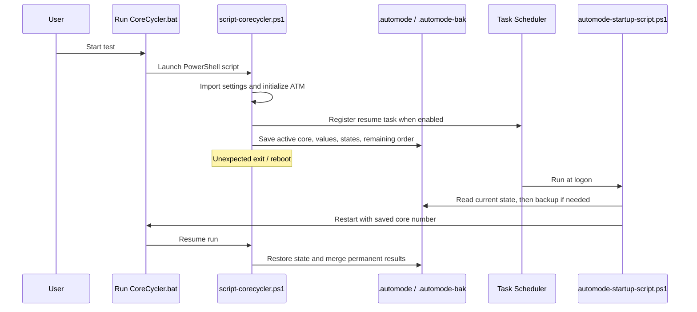
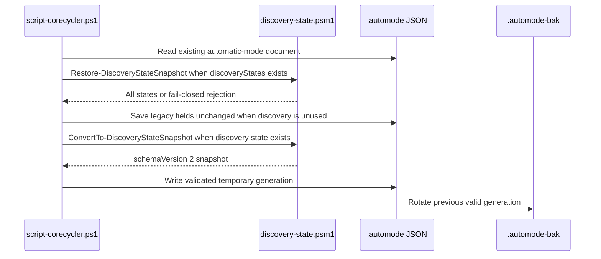
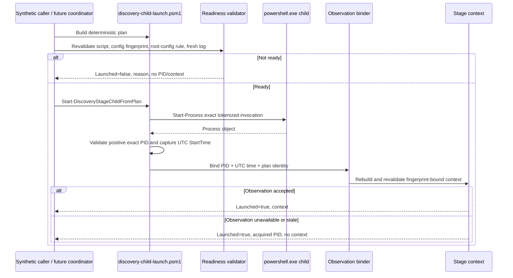
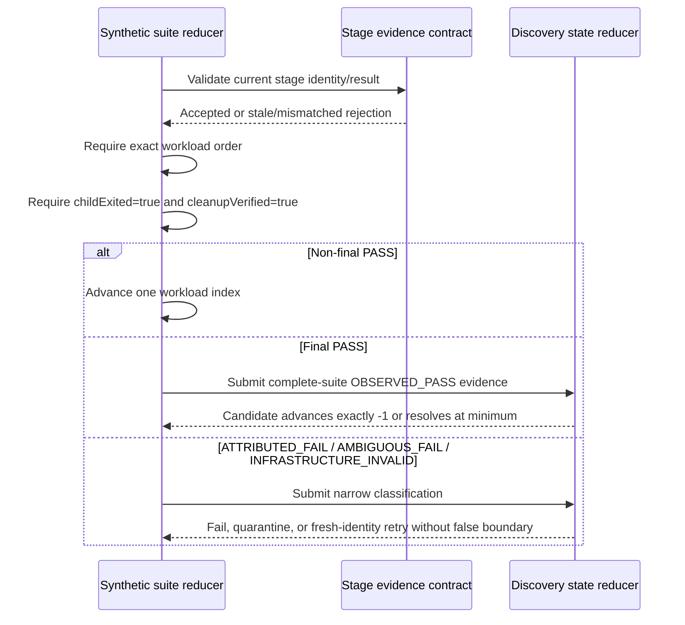

# Sequence Diagrams

## Existing Automatic Test Mode startup and recovery

This reflects the current legacy ATM implementation.

## Optional discovery snapshot persistence

The discovery field is optional and isolated from legacy ATM state. Malformed, stale, torn, missing-core, or unexpected-core discovery snapshots are rejected without returning a partial state.

## Phase 3 child-launch seam

This is an isolated execution seam, not a production discovery call path. The current test uses only a harmless temporary child script; no CoreCycler workload, parser, CO action, scheduler/resume action, UAC flow, or hardware operation is invoked.

## Pure ordered suite reduction

The reducer is synthetic and pure. Runtime stage parsing and coordinator wiring remain future work.
