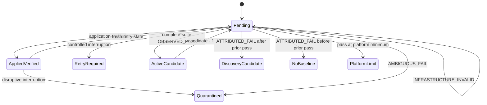

# Module: Discovery state

## Status

[`helpers/discovery-state.psm1`](../../../helpers/discovery-state.psm1) is a tracked Phase 1–2 helper module. It is imported by [`script-corecycler.ps1`](../../../script-corecycler.ps1) only for optional discovery snapshot persistence/restoration. It does not schedule a discovery run, apply CO, launch workloads, or decide hardware actions.

## Public API

| Function | Behavior |
|---|---|
| `New-DiscoveryCoreState` | Creates a core state with candidate, platform minimum, candidate attempt ID, distinct stage IDs, `attemptStatus = PENDING`, and discovery evidence fields. |
| `Resolve-DiscoveryEvidence` | Validates application and candidate/stage identity, then applies `OBSERVED_PASS`, `ATTRIBUTED_FAIL`, `AMBIGUOUS_FAIL`, or `INFRASTRUCTURE_INVALID` semantics. |
| `Resolve-DiscoveryInterruption` | Converts an interrupted pending attempt to fresh-identity retry or an interrupted applied attempt to quarantine. |
| `New-DiscoveryRetryState` | Creates a retry only with candidate and stage IDs fresh across the prior attempt. |
| `Test-DiscoveryCoreCanBeScheduled` | Filters terminal and retry-required states from future scheduling. |
| `ConvertTo-DiscoveryStateSnapshot` | Produces schema version 2 state snapshots with required attempt status and normalized identities. |
| `Restore-DiscoveryStateSnapshot` | Validates and restores an all-or-nothing snapshot, rejecting stale, torn, malformed, missing-core, and unexpected-core input. |

## State and transitions

`OBSERVED_PASS` requires verified application, matching candidate/stage identities, and a complete suite. A pass records `lastObservedPass` and advances exactly one negative CO step unless the platform minimum is reached. An attributable failure resolves to the previous complete-suite pass when one exists. Ambiguous and infrastructure-invalid evidence does not manufacture a silicon boundary.

## Persistence invariants

- Discovery state is stored under optional `discoveryStates`; legacy `.automode` fields remain unchanged when discovery is unused.
- Snapshot `schemaVersion` is `2` and each state requires `attemptStatus`.
- Candidate and stage IDs must be distinct; stage IDs must be unique.
- Recovery is fail-closed and atomic: a malformed or inconsistent snapshot returns no recovered states.
- Retry IDs must be fresh across both candidate and stage identities, including cross-role reuse.
- Terminal resolutions are not schedulable.

## Tests

- [`tests/DiscoveryState.Tests.ps1`](../../../tests/DiscoveryState.Tests.ps1) covers transitions, identity separation, interruption/retry semantics, schema round trips, stale/torn recovery, expected-core validation, platform limits, and terminal filtering.
- [`tests/DiscoveryPersistenceContract.Tests.ps1`](../../../tests/DiscoveryPersistenceContract.Tests.ps1) covers optional atomic integration with the `.automode` document and preservation of the legacy schema when discovery is absent.
